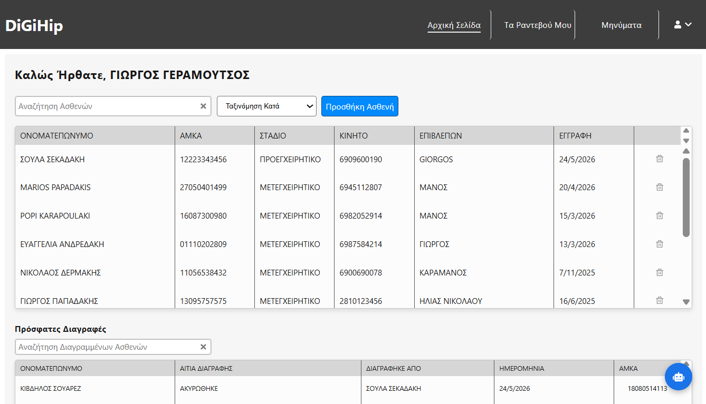
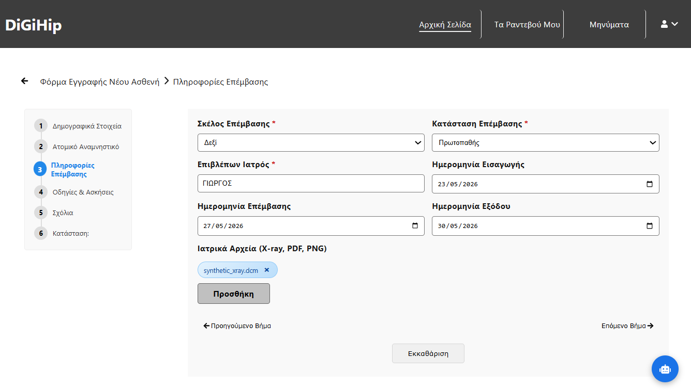
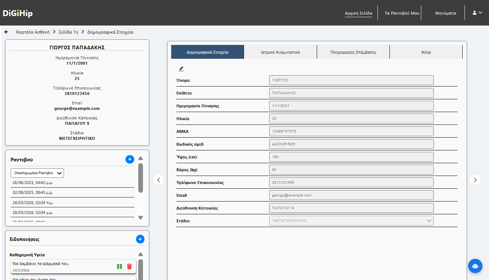
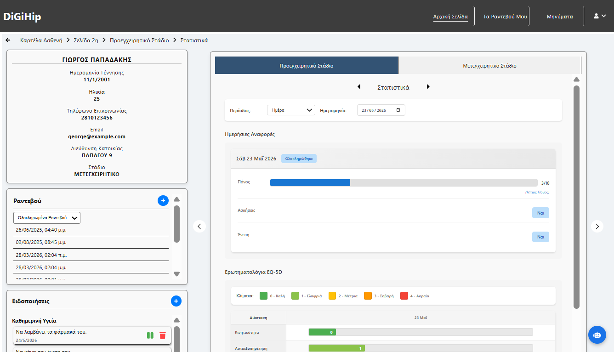
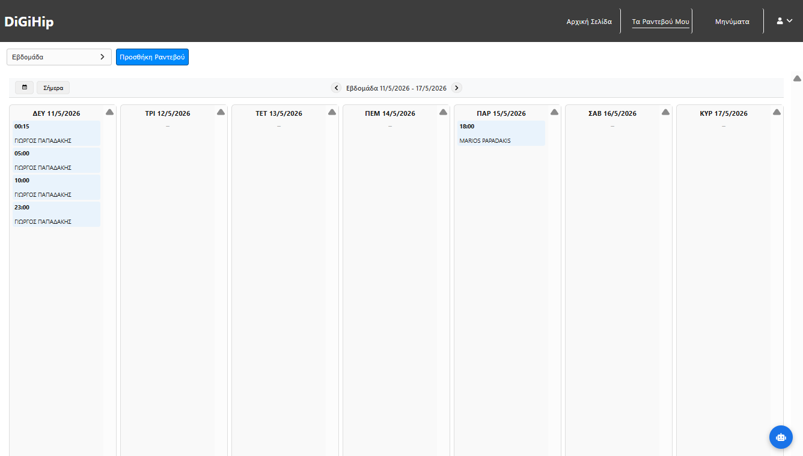
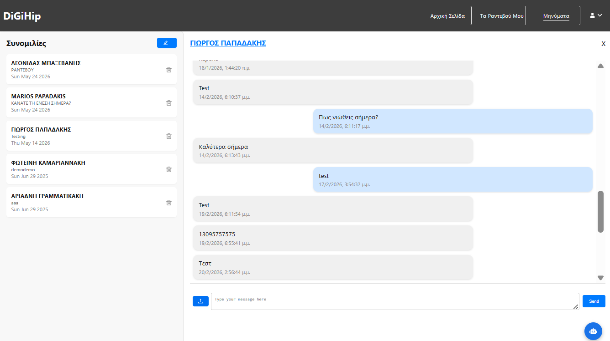

# Digihip
Digital Hip Replacement Web App

A full-stack web application developed as a thesis project, designed to help doctors **monitor and manage patients** recovering from hip replacement surgery. Digihip streamlines the clinical workflow by centralizing patient data, appointments, real-time communication, and recovery tracking in one platform.

---

## 📌 Table of Contents

- [Overview](#overview)
- [Features](#features)
- [Tech Stack](#tech-stack)
- [Architecture](#architecture)
- [Getting Started](#getting-started)
- [Screenshots](#screenshots)

---

## Overview

Digihip bridges the gap between patients and healthcare providers during the post-operative recovery period. Doctors get a centralized dashboard to track every patient's health journey — from clinical data and daily questionnaires to exercise compliance and medication adherence — while patients can communicate directly with their doctor in real time.

---

## ✨ Features

### 🏠 Homepage — Patient Management
- Searchable and filterable **patient table** with key demographics at a glance
- View and restore **soft-deleted patients**
- Navigate directly to a patient's full profile with a single click
- **Register new patients** via a structured clinical intake form

### 📅 Appointments
- Interactive calendar with **monthly, weekly, and daily views**
- Create, edit, and delete appointments directly from the calendar
- Clean overview of the doctor's full schedule

### 💬 Real-Time Messaging
- **Live chat** between doctors and patients powered by Socket.IO
- Support for **file attachments** (documents, images, etc.)
- Instant, bidirectional communication without page refresh

### 👤 Patient Profile Page
A comprehensive view of each patient's recovery journey, including:
- **Demographic and clinical data**
- Personalized **exercise plans** — modifiable by the doctor
- **Medical instructions and notes**
- **Medication management** — add, edit, and track prescriptions
- **Recovery statistics** derived from daily patient questionnaires
  - Exercise completion rates
  - Medication adherence tracking
  - Symptom and progress trends

---

## 🛠 Tech Stack

| Layer | Technology |
|---|---|
| Frontend | [Next.js](https://nextjs.org/) (React framework) |
| Backend | [Express.js](https://expressjs.com/) (Node.js) |
| Real-Time | [Socket.IO](https://socket.io/) |
| Database | [MongoDB](https://www.mongodb.com/) |
| Process Manager | [PM2](https://pm2.keymetrics.io/) |
| Reverse Proxy | [Nginx](https://nginx.org/) |

---

## 🏗 Architecture

```
┌─────────────────────────────────────────────┐
│                   Client                     │
│              Next.js (React)                 │
└──────────────┬──────────────────────────────┘
               │ HTTP / WebSocket
               ▼
┌─────────────────────────────────────────────┐
│                  Nginx                       │
│   (Reverse Proxy / Static File Serving)      │
└──────────────┬──────────────────────────────┘
               │
       ┌───────┴────────┐
       ▼                ▼
┌────────────┐   ┌─────────────┐
│  Express   │   │  Socket.IO  │
│  REST API  │   │  WS Server  │
└─────┬──────┘   └──────┬──────┘
      │                 │
      └────────┬────────┘
               ▼
┌─────────────────────────────────────────────┐
│                  MongoDB                     │
└─────────────────────────────────────────────┘
               
PM2 manages and keeps Express + Socket.IO processes alive
```

---
<!--
## 🚀 Getting Started

### Prerequisites

- Node.js >= 18
- MongoDB (local or Atlas)
- PM2 (`npm install -g pm2`)
- Nginx (for production deployment)

### Installation

```bash
# Clone the repository
git clone https://github.com/geoge31/Thesis-Digihip.git
cd Thesis-Digihip
```

**Backend:**
```bash
cd backend
npm install
cp .env.example .env   # configure your environment variables
pm2 start server.js --name digihip-api
```

**Frontend:**
```bash
cd frontend
npm install
cp .env.example .env.local   # set your API base URL
npm run build
npm run start
```

> ⚙️ For production, configure Nginx to reverse proxy API requests to the Express server and serve the Next.js app.

---

-->

## 📸 Screenshots

> - ## Home Page
   
> - ## New patient registration form
   
> - ## Patient profile with demographic and clinical data and statistics
   
   
> - # Appointments (monthly, weekly or daily view)
   
> - # Messages
   

---

## 📄 License

This project was developed as a university thesis. Feel free to explore the code for educational purposes.
